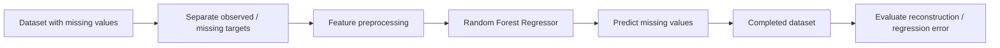

<div align="center">

# DataCompletion
### Archived Data-Completion / Regression Experiment


</div>

## Overview

This repository was created for an early machine-learning experiment around **data completion using regression**, with Random Forest regression as the intended modeling approach.

The current public repository is intentionally documented as an **incomplete historical archive**: `RandomForestRegressor.py` exists but is empty, and the original data / runnable implementation are not present. This README therefore explains the intended learning task without presenting the repository as a reproducible finished system.

## Intended Workflow



The conceptual task is a common supervised imputation pattern: use rows where the target variable is known to train a regression model and use the learned mapping to estimate values for rows where that variable is missing.

## Repository Contents

```text
dataCompletion/
├── RandomForestRegressor.py   # Empty placeholder from the original exercise
├── .idea/                     # Original IDE metadata
└── README.md
```

## What Would Be Needed for Reproduction

A complete version would require:

1. the original dataset and train/test split;
2. feature/target definitions;
3. missing-value selection logic;
4. the Random Forest regression implementation or sklearn pipeline;
5. evaluation metrics such as MAE / RMSE;
6. an executable entry point or notebook.

None of these are reconstructed here because the current repository does not contain enough evidence to recover them faithfully.

## Why Keep This Repository Public?

The repository is part of my early machine-learning learning history. Keeping it visible—while clearly marking its incomplete state—is more transparent than presenting a placeholder as a finished project. It also shows the progression from introductory regression/data-completion exercises toward later graph-learning, diffusion, spatiotemporal and LLM-based research.

## Status

**Archive / incomplete.** No claim is made that this repository currently provides a runnable data-completion model.

## Maintainer

**Bo Liu**  
Contact: `liubo317@hnu.edu.cn`  
Homepage: https://boliupro.github.io
